# 小区物业管理系统

## 一、介绍

基于springboot + mybatis + thymeleaf + Mysql的物业管理系统

### 完整项目获取

通过网盘分享的文件：project

链接: https://pan.baidu.com/s/1de5UsIdmE53buY4-sl3krg?pwd=314z 提取码: 314z
--来自百度网盘超级会员v3的分享

通过网盘分享的文件：工具包

链接: https://pan.baidu.com/s/1YmdoJvkjoUjA75wvHLDZ6A?pwd=xm96 提取码: xm96
--来自百度网盘超级会员v3的分享

通过网盘分享的文件：远程调试部署联系方式

链接: https://pan.baidu.com/s/1W0dDcoZmayG0c7USJDYBYg?pwd=nqd7 提取码: nqd7
--来自百度网盘超级会员v3的分享

## 二、系统运行界面图

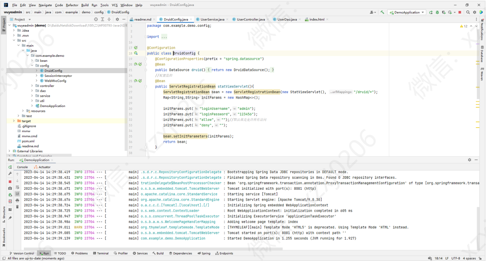

## 三、系统部分功能截图

### 1、管理员

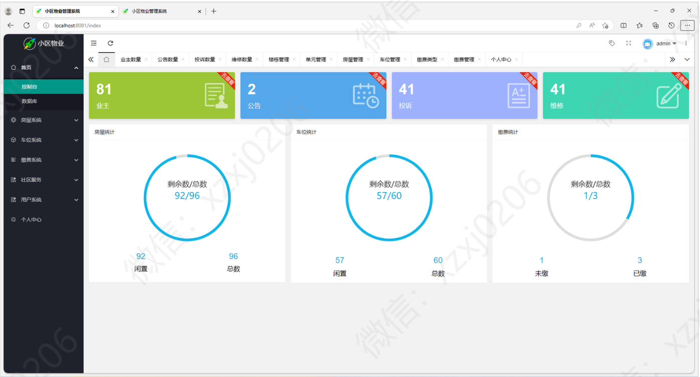

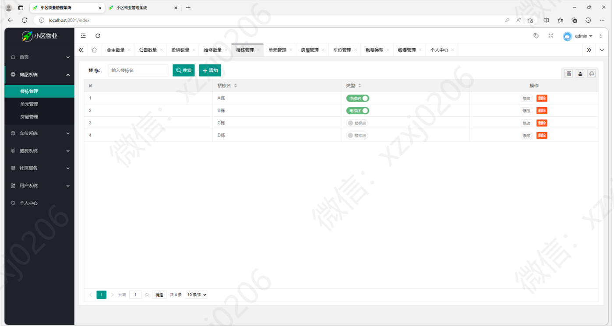

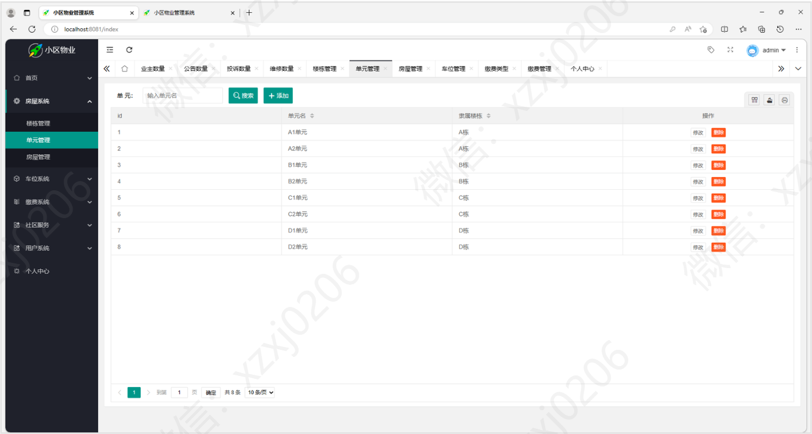

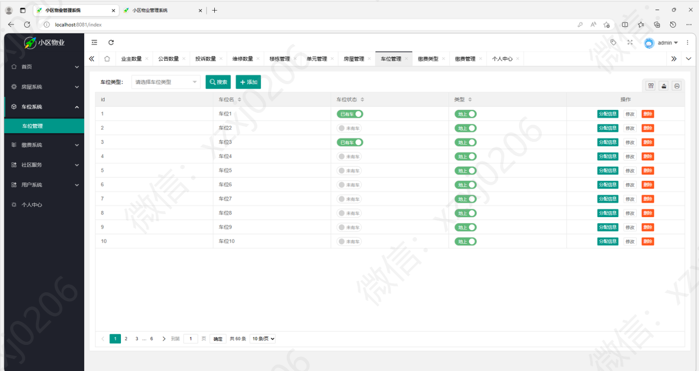

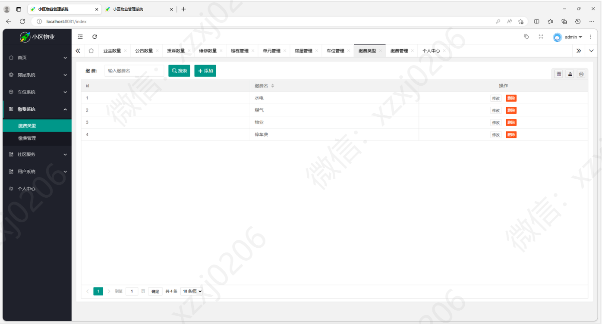

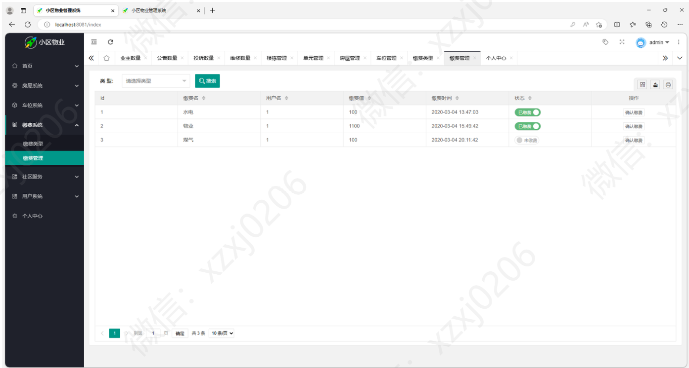

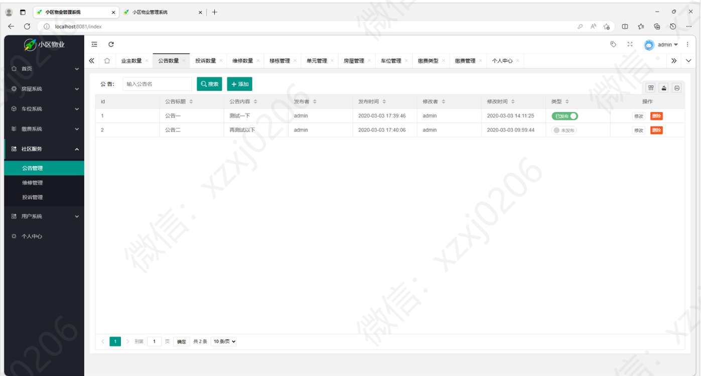

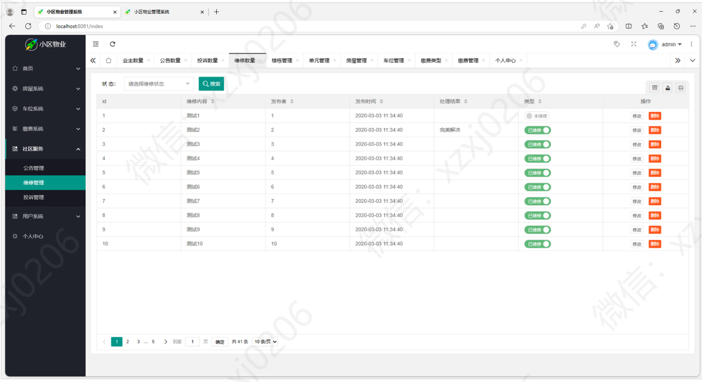

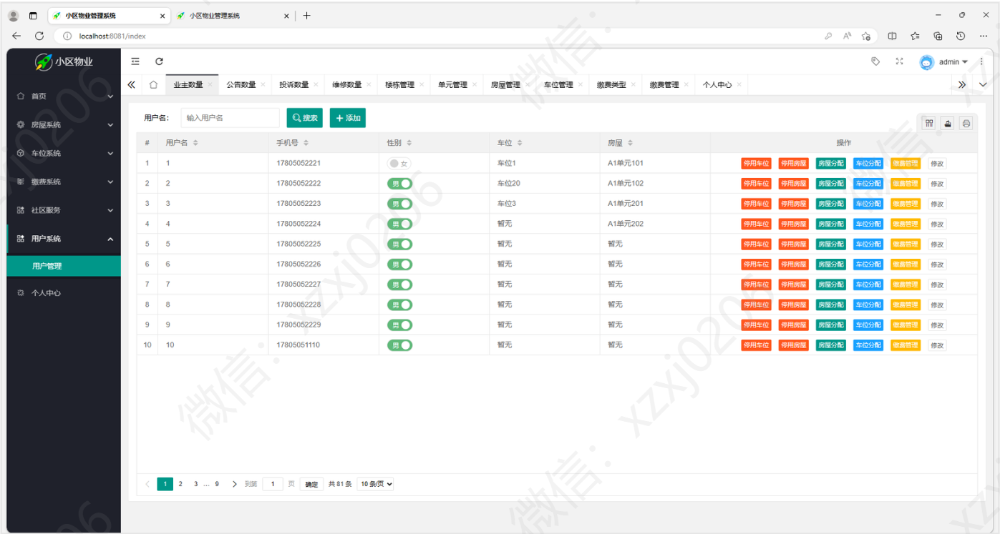

### 2、用户

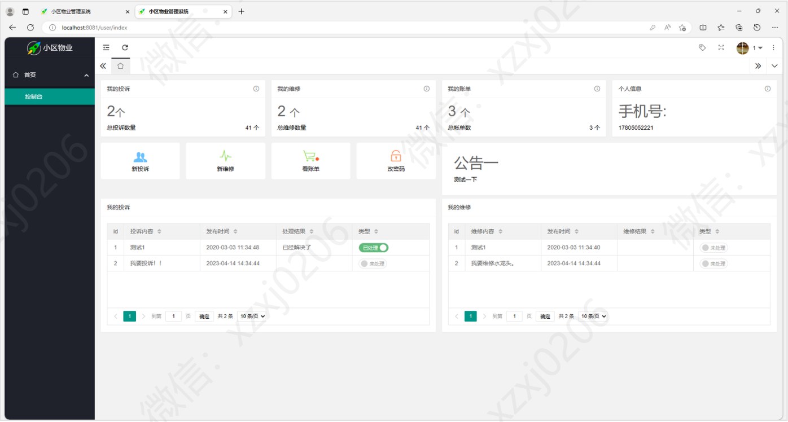

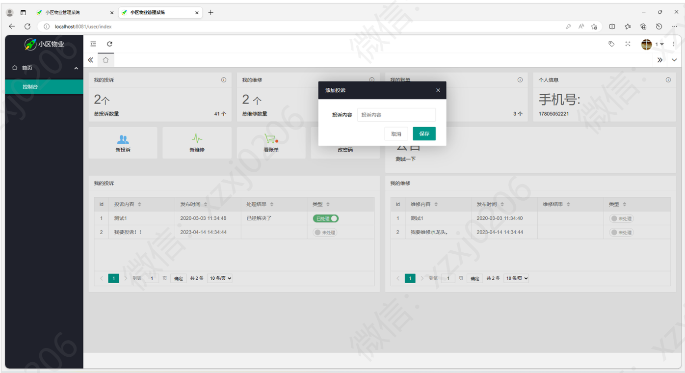

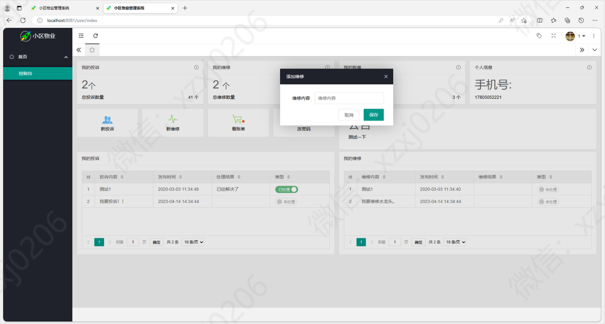

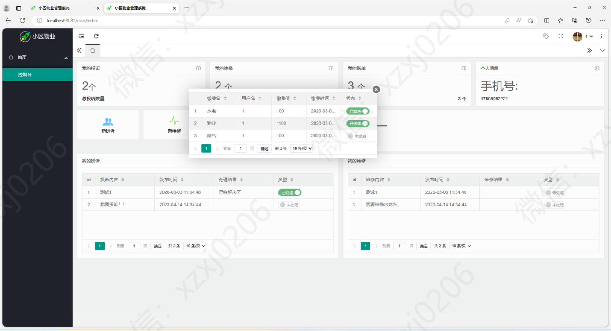

